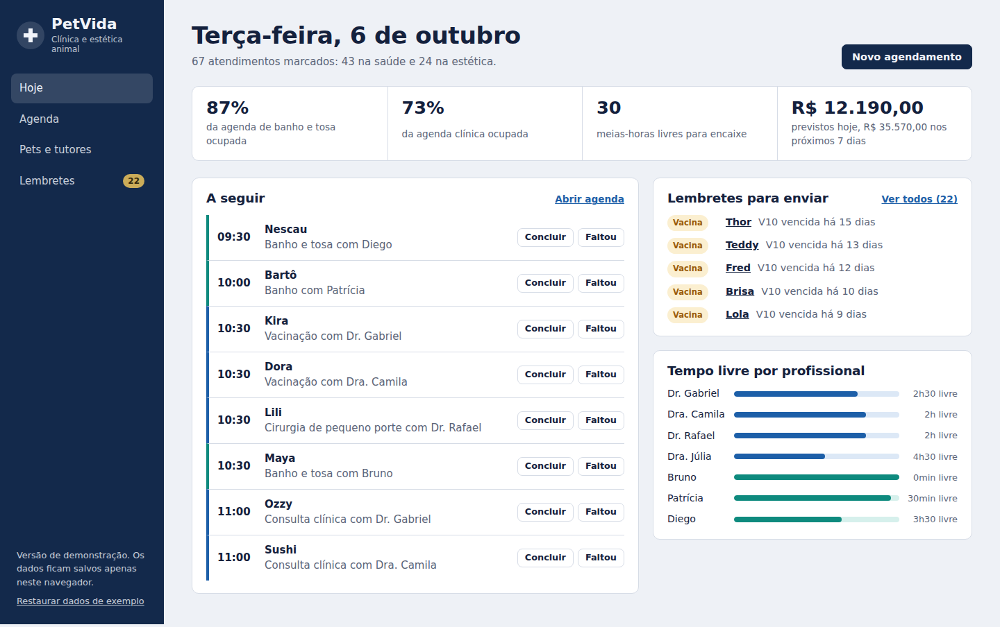
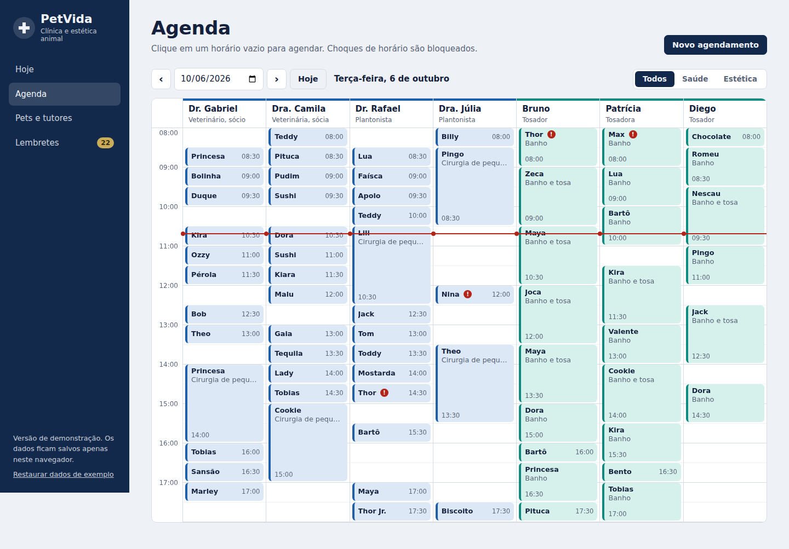
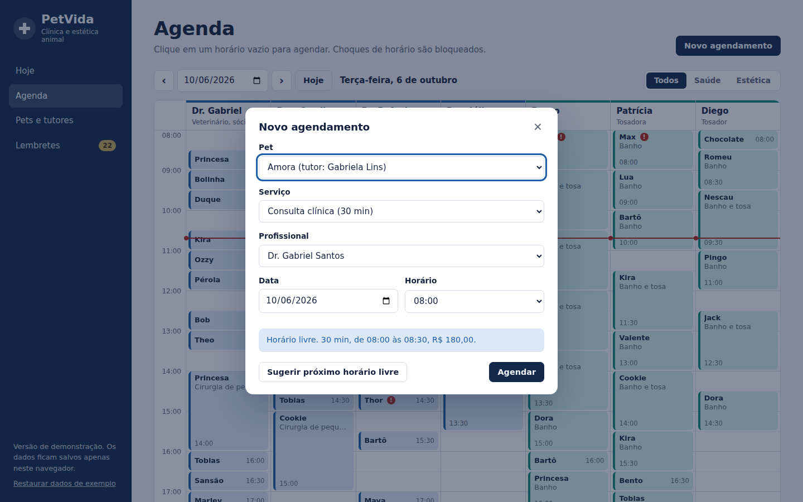
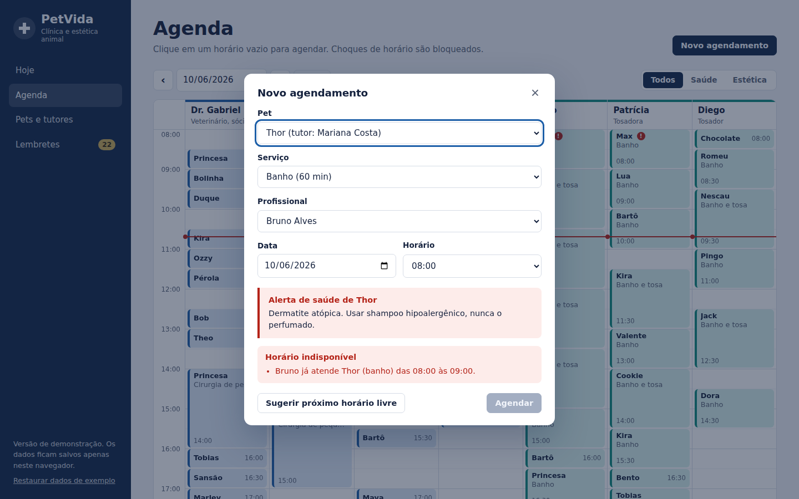
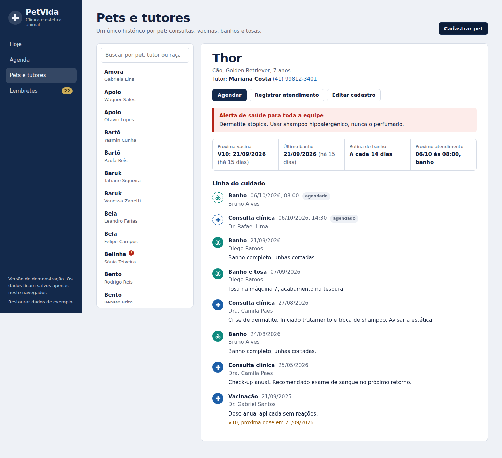
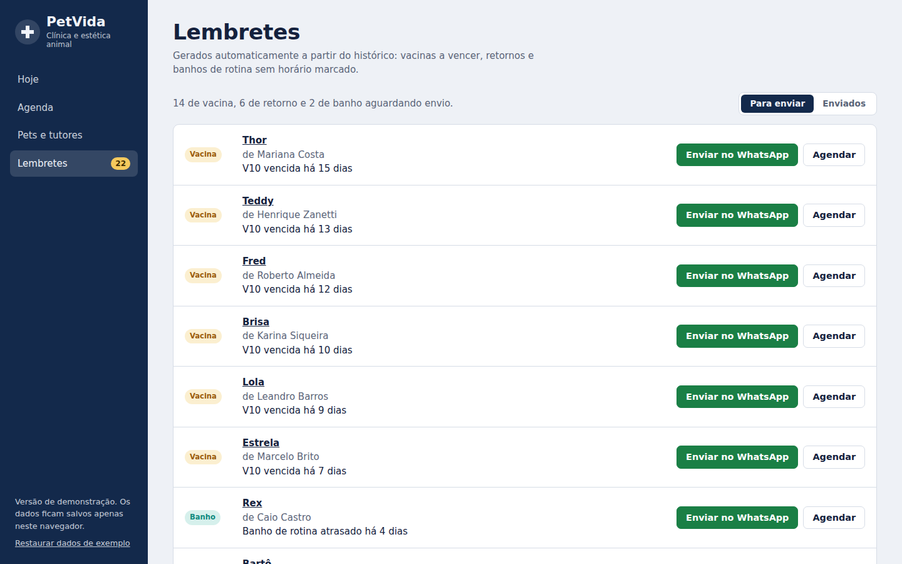
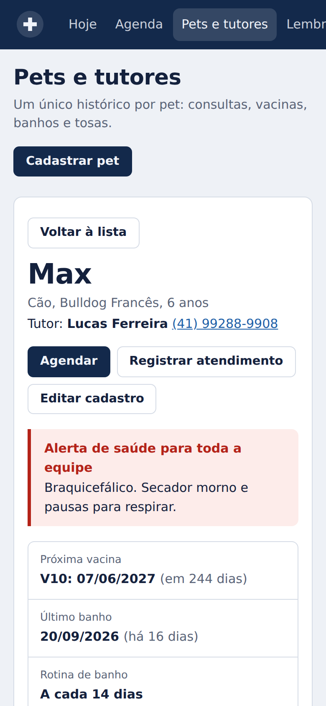
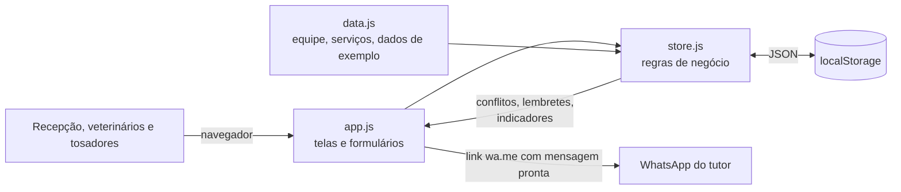
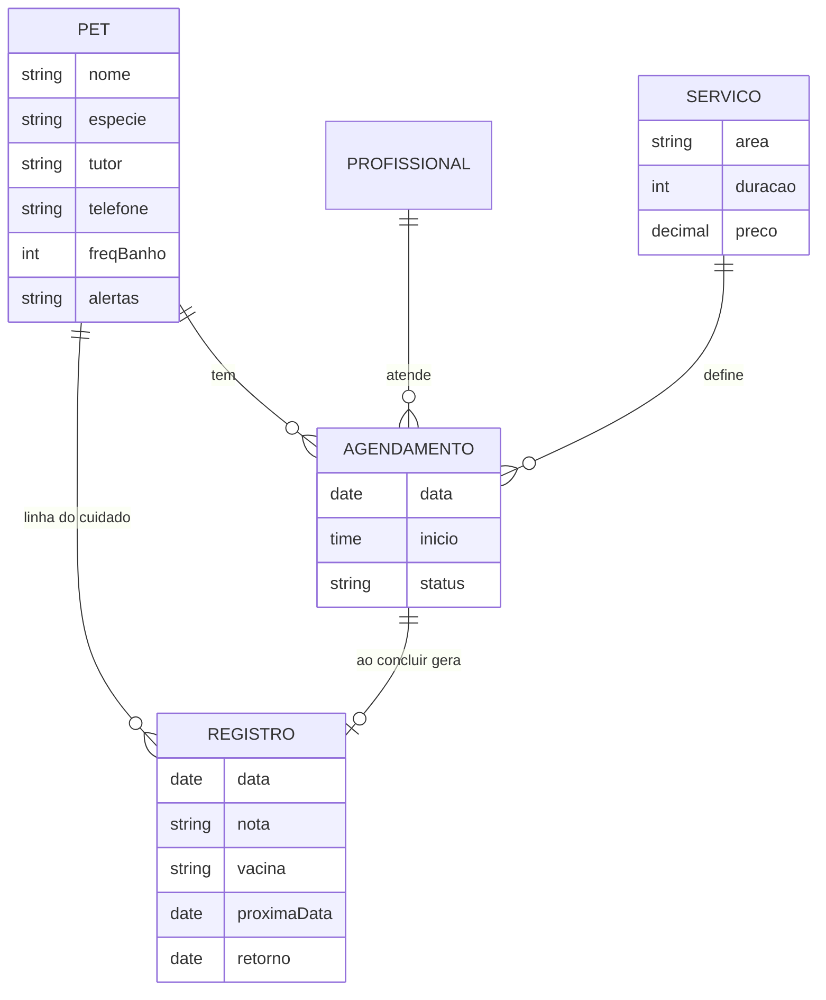

# PetVida: agenda e prontuário da clínica

Sistema web de recepção para a **Clínica PetVida & Estética Animal**: agenda sem choque de horários, prontuário único que junta saúde e estética de cada pet e lembretes automáticos para os tutores via WhatsApp.

**Acesse online:** https://lourencoterrana.github.io/Trabalho_Clinica_Petvida/



> Projeto desenvolvido para a disciplina **Design Profissional: Produção de Portfólio & Desenvolvimento Empresarial** (Prof. Sedenilso Antonio Machado), Estudo de Caso 5.

---

## Sumário

1. [Briefing do problema](#1-briefing-do-problema)
2. [Decisão de solução: por que um sistema web](#2-decisão-de-solução-por-que-um-sistema-web)
3. [Como a solução resolve cada dor](#3-como-a-solução-resolve-cada-dor)
4. [Protótipos e telas](#4-protótipos-e-telas)
5. [Arquitetura](#5-arquitetura)
6. [Como executar](#6-como-executar)
7. [Segurança e credenciais](#7-segurança-e-credenciais)
8. [Próximos passos](#8-próximos-passos)
9. [Licença e autoria](#9-licença-e-autoria)

---

## 1. Briefing do problema

**Cliente:** PetVida, clínica veterinária de bairro com centro de estética (banho e tosa), fundada pelo Dr. Gabriel Santos e pela Dra. Camila Paes, sócios em partes iguais.

**Equipe:** 4 veterinários (2 sócios e 2 plantonistas), 3 tosadores e 2 recepcionistas.

**Serviços:** consultas, vacinação, cirurgias de pequeno porte, banho e tosa.

**Situação atual:** todo o agendamento é feito por telefone e anotado em uma agenda de papel na recepção. Os históricos médicos ficam em pastas físicas.

**Dores identificadas:**

| Dor | Consequência para o negócio |
| --- | --- |
| Mais de 30 banhos por dia e consultas sobrepostas anotados à mão | Choques de horário, atrasos e tutores insatisfeitos |
| Tutores esquecem a data do banho e da vacina | Lacunas na agenda que não são preenchidas a tempo, receita perdida |
| Nenhum lembrete de retorno preventivo | Perda de recorrência e de receita previsível |
| Histórico médico em arquivo morto de papel | Recepção perde minutos procurando pastas; a estética não sabe das condições de saúde do pet |

**Oportunidade:** pet shops de rede da região já oferecem agendamento simples, mas a PetVida tem a **confiança médica** dos tutores. A grande vantagem competitiva é **integrar o cuidado estético ao histórico de saúde do animal**: praticidade para o tutor e previsibilidade de caixa para a clínica.

---

## 2. Decisão de solução: por que um sistema web

O enunciado permitia escolher entre aplicativo móvel, site institucional ou sistema/dashboard. A escolha foi um **sistema web (web app) de uso interno**, focado na recepção, pelos motivos abaixo.

**Quem sofre a dor é a equipe, não o tutor.** O caos nasce na recepção: agenda de papel, choques de horário e pastas físicas. Um site institucional não resolveria nada disso, e um app para tutores dependeria de cada cliente baixar e adotar, sem garantir o fim dos conflitos.

**Roda em qualquer computador ou tablet, sem instalação.** A recepção usa o computador do balcão; tosadores e veterinários podem consultar a agenda e os alertas de saúde pelo navegador do tablet ou celular (o layout é responsivo).

**O tutor é alcançado pelo canal que ele já usa.** Em vez de obrigar o tutor a instalar um app, os lembretes saem pelo **WhatsApp**, com mensagem pronta e personalizada. Isso resolve o esquecimento sem criar atrito.

**Custo zero de infraestrutura nesta fase.** A versão atual é estática e hospedada gratuitamente no GitHub Pages, o que permite validar o fluxo com a equipe antes de investir em servidor e banco de dados.

Alternativas consideradas e descartadas nesta fase:

| Alternativa | Motivo de descarte |
| --- | --- |
| App móvel para tutores | Depende de adoção pelo cliente; não resolve a agenda interna nem o prontuário |
| Site institucional | Não ataca nenhuma das dores operacionais |
| Software de prateleira | Não integra estética ao prontuário de saúde, que é o diferencial da PetVida |

---

## 3. Como a solução resolve cada dor

| Dor | Funcionalidade |
| --- | --- |
| Choques de horário | **Agenda por profissional** com validação em tempo real: o sistema bloqueia o botão "Agendar" quando o profissional ou o pet já estão ocupados, quando o horário passa das 18:00 ou cai num domingo |
| Lacunas na agenda | **Sugestão do próximo horário livre** em qualquer profissional da área, e painel de **tempo livre por profissional** para encaixes |
| Esquecimento de banho e vacina | **Lembretes automáticos** calculados a partir do histórico: vacina a vencer (15 dias), retorno indicado e banho de rotina conforme a frequência de cada pet. Um clique abre o WhatsApp com a mensagem pronta |
| Falta de lembrete de retorno | Ao concluir uma consulta, a recepção registra a data de retorno, que vira lembrete automaticamente |
| Histórico em pastas físicas | **Prontuário único** ("linha do cuidado") com consultas, vacinas, cirurgias, banhos e tosas do pet em uma só linha do tempo |
| Estética sem informação clínica | **Alerta de saúde** cadastrado pelo veterinário aparece para toda a equipe: na agenda (marcador vermelho), no formulário de agendamento e na fila do dia. Ex.: "Dermatite atópica, usar shampoo hipoalergênico" |
| Previsibilidade de caixa | Indicadores de **ocupação por área** e **receita prevista** do dia e dos próximos 7 dias |

---

## 4. Protótipos e telas

### Hoje (painel da recepção)
Fila do que vem a seguir, com alertas de saúde visíveis, lembretes pendentes e tempo livre de cada profissional.


### Agenda por profissional
Colunas por profissional, com cores por área: azul para saúde e verde-água para estética. Clicar em um horário vazio abre o agendamento já preenchido. A linha vermelha marca o horário atual.



### Novo agendamento com bloqueio de conflito
O sistema mostra o alerta de saúde do pet e impede o choque de horários antes de salvar.

| Agendamento | Conflito bloqueado |
| --- | --- |
|  |  |

### Prontuário único: linha do cuidado
Saúde e estética na mesma linha do tempo, com o que já foi feito e o que está agendado.



### Lembretes automáticos
Vacinas, retornos e banhos de rotina sem horário marcado, com envio pelo WhatsApp e agendamento em um clique.



### Versão para celular e tablet



### Identidade visual

| Elemento | Escolha | Motivo |
| --- | --- | --- |
| Cor base | `#13294B` azul-marinho | Transmite seriedade e confiança médica, o principal ativo da PetVida |
| Cor de saúde | `#1D5FA8` azul | Mantém a área clínica ligada à identidade da marca |
| Cor de estética | `#0E8A7E` verde-água | Contrasta com o azul e diferencia banho e tosa de imediato na agenda |
| Cor de alerta | `#B42318` vermelho | Usada só para alerta de saúde e conflito, para nunca perder força |
| Tipografia | Bricolage Grotesque (títulos) e Figtree (texto) | Amigável sem ser infantil, boa leitura em telas pequenas |

---

## 5. Arquitetura

Aplicação **front-end estática** (HTML, CSS e JavaScript puro), sem dependências e sem etapa de build. Os dados ficam no `localStorage` do navegador e, na primeira abertura, o sistema gera dados de exemplo relativos à data atual, para que a demonstração esteja sempre "viva".



### Estrutura de pastas

```
Trabalho_Clinica_Petvida/
├── index.html          # estrutura da página e navegação
├── css/
│   └── styles.css      # identidade visual e layout responsivo
├── js/
│   ├── data.js         # equipe, serviços, utilitários de data e gerador de dados de exemplo
│   ├── store.js        # persistência e regras: conflitos, lembretes, sugestão de horário, indicadores
│   └── app.js          # roteamento por hash e renderização das telas
├── docs/telas/         # capturas usadas neste README
├── .env.example        # referência para a fase 2 (sem valores reais)
├── .gitignore
├── LICENSE
└── README.md
```

### Modelo de dados



### Regras de negócio principais (`store.js`)

- **`conflitos()`**: dois atendimentos se chocam quando os intervalos se sobrepõem para o mesmo profissional ou para o mesmo pet. Também valida horário de funcionamento (08:00 às 18:00, fechado aos domingos) e se o profissional é da área do serviço.
- **`proximoLivre()`**: percorre até 21 dias, em passos de 30 minutos, todos os profissionais da área, e devolve o primeiro encaixe sem conflito.
- **`lembretes()`**: vacina com próxima dose em até 15 dias, retorno indicado em até 7 dias e banho de rotina previsto em até 3 dias, desde que o pet ainda não tenha horário marcado para aquilo.

### Decisões técnicas

| Decisão | Justificativa |
| --- | --- |
| JavaScript puro, sem framework | Zero dependências, abre com duplo clique, fácil de avaliar e de manter |
| `localStorage` | Permite demonstrar o fluxo completo sem servidor; os dados persistem no navegador |
| Link `wa.me` em vez da API do WhatsApp | Funciona sem credenciais e sem custo; a API oficial fica para a fase 2 |
| GitHub Pages | Hospedagem gratuita e publicação direta a partir do repositório |

---

## 6. Como executar

### Online
Acesse **https://lourencoterrana.github.io/Trabalho_Clinica_Petvida/**

### Localmente

```bash
git clone https://github.com/lourencoterrana/Trabalho_Clinica_Petvida.git
cd Trabalho_Clinica_Petvida
```

Depois, **abra o arquivo `index.html` no navegador** (duplo clique). Não há dependências para instalar.

Se preferir servir por HTTP:

```bash
python -m http.server 8000
# acesse http://localhost:8000
```

### Publicar no GitHub Pages
1. No repositório, abra **Settings > Pages**.
2. Em **Source**, escolha **Deploy from a branch**, branch `main`, pasta `/ (root)`.
3. Salve e aguarde cerca de 1 minuto. O endereço aparece no topo da página.

### Roteiro rápido de demonstração
1. Na tela **Hoje**, veja a fila do dia com os alertas de saúde em vermelho e conclua um atendimento.
2. Na **Agenda**, clique em um horário ocupado de um tosador e tente agendar: o conflito é bloqueado. Use **Sugerir próximo horário livre**.
3. Em **Pets e tutores**, abra o **Thor**: alerta de dermatite e linha do cuidado com consultas e banhos juntos.
4. Em **Lembretes**, envie uma mensagem pelo WhatsApp ou clique em **Agendar** para marcar direto.
5. Para recomeçar, use **Restaurar dados de exemplo** no menu lateral.

---

## 7. Segurança e credenciais

- **Nenhuma credencial, senha, token ou chave de API** existe no código ou no histórico de commits. Esta versão não precisa de nenhuma.
- O `.gitignore` bloqueia `.env`, `.env.*`, chaves (`*.pem`, `*.key`) e `secrets.json`, além de `node_modules`, pastas de build, logs e arquivos de sistema e de IDE.
- O `.env.example` documenta, **sem valores**, as variáveis que a fase 2 vai precisar. Valores reais ficarão só no `.env` local ou nos *secrets* do provedor de hospedagem.
- Todo texto digitado é escapado antes de ir para a tela, evitando injeção de HTML.
- Os dados de exemplo (nomes e telefones) são fictícios.

---

## 8. Próximos passos

**Fase 2: dados compartilhados.** Backend (Node.js + PostgreSQL ou Supabase) para que recepção, veterinários e tosadores vejam a mesma agenda em tempo real, com login por perfil.

**Fase 3: automação.** Envio automático dos lembretes pela API oficial do WhatsApp Business e confirmação de presença pelo tutor.

**Fase 4: portal do tutor.** Página para o tutor ver a carteira de vacinação e o histórico do pet e reservar horários livres de banho.

---

## 9. Licença e autoria

Distribuído sob a licença **MIT**. Veja o arquivo [LICENSE](LICENSE).

Desenvolvido por **Lourenço da Silva Carneiro Terrana**, estudante de Análise e Desenvolvimento de Sistemas na Universidade Positivo.
